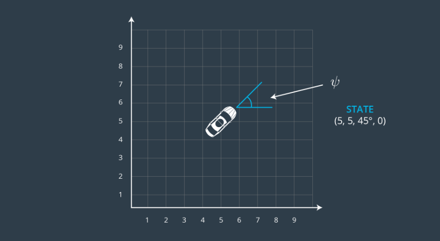
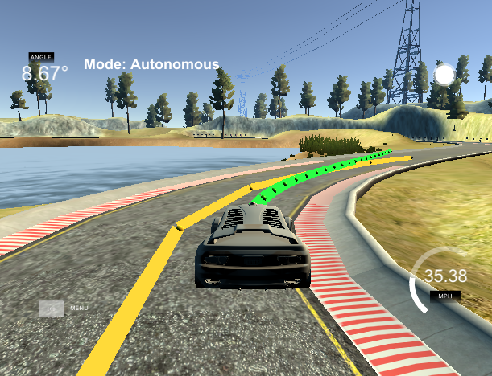
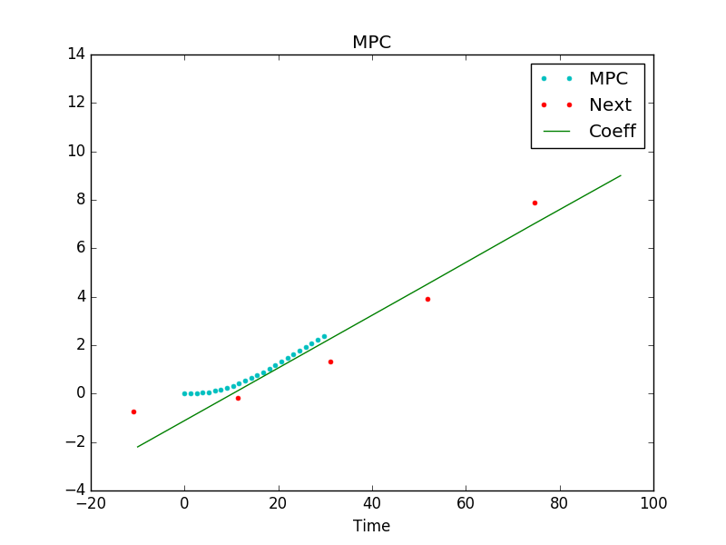
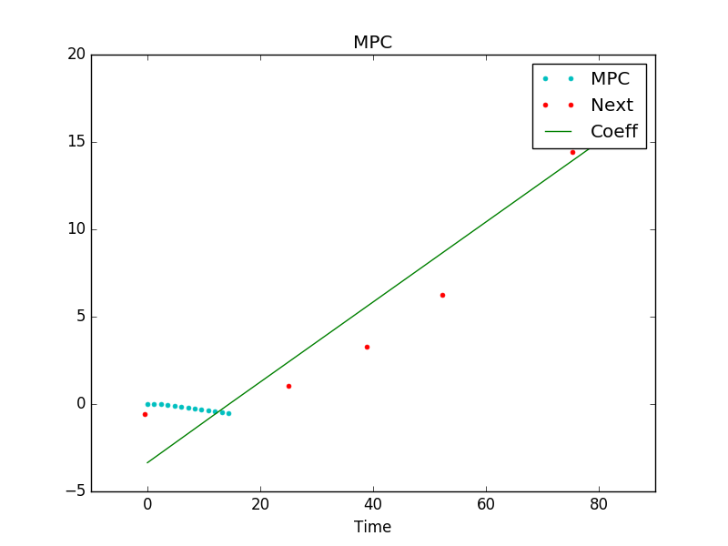

This is a discussion for the Udacity Self Driving Car ***Model-Predictive-Control (MPC)*** project:


# Model Description (state, actuators and update equations):

In this project we make use of a simplified (bicycle based) kinematic model (i.e., ignoring tire slipping, mass etc.)

Throughout the project we define the vehicle state as a vector **[x,y,ψ,v]**, where x & y are vehicle positions; ψ is the vehicle orientation and v is the velocity.

The figure below shows an example state with x=y=5, orientation angle 45 degrees and velocity of 0.


Please note that in this project the state vector of the vehicle shows the first three elements (position x,y & angle) as 0, which is due to the fact the we report the state in vehicle coordinates, which moves with the position and orientation of the car.

In addition to state, we also model inputs to our model; i.e. control. So called actuators allow us to control the vehicle. In this project we make use of two actuators: **δ** for steering angle and **a** for acceleration (throttle/brake combined).

With the introduction of the state vector and actuator input, we can now define our simplified kinematic model:

**The equations for the model** (taken from MPC.cpp)
```{r}
x_[t+1] = x[t] + v[t] * cos(psi[t]) * dt

y_[t+1] = y[t] + v[t] * sin(psi[t]) * dt

psi_[t+1] = psi[t] + v[t] / Lf * delta[t] * dt

v_[t+1] = v[t] + a[t] * dt
```

The only new variable her is **L_f**, which measures the distance between the front of the vehicle and its center of gravity and affects the turn rate of the car.


# MPC main algorithm:

The central pieces of the MPC algorithm (code in main.cpp) are as follow:

In each iteration we receive the cars position and angle (in map coordinates) as well as the velocity from the simulator. In addition we get a series of points (also in map coordinates), which represent the so called *reference trajectory* - the ideal path our car should follow.

Since all our following calculations for the model predictive controller (like CTE, etc.) are performed in the vehicle's coordinate system, we first transform these reference path points into vehicle space.
(in the code next_x_vals/next_y_vals -- yellow line in the picture below)

Next, we fit a polynom through the reference path (in vehicle space) and save its coefficients.
This polynom as well as the state vector (with car position as 0/0 and angle as 0 in vehicle space) are passed to a solver in MPC.cpp which returns an optimal trajectory for the vehicle given its state, reference path and obeying certain constraints.
Constrains (in *FG_eval* in MPC.cpp) are set and emphasized especially to minimize the use of actuators (acceleration and steering) and to avoid big jumps between actuations (like abrupt steering). Moreover, we also penalize the vehicle for not maintaining the reference velocity.

One central output of the solver are vectors mpc_x_vals/mpc_y_vals, which reflect the projected line calculated by the optimizer (shown in green in the picture below.). The solver tries to optimize the control inputs [δ,a] and given our state and contraints comes up with a projected line over a certain time duration. These control inputs / actuators are also returned by the solver and passed to the simulator in each iteration.



Interestingly a **1D polynom** (a simple line) to fit the reference path gave best results for the given track. In the image above one can see that the green line nicely manages curves due to its tangential nature, which seems ideal for a race track (without going over curbs or such).

However, this nice behavior is only possible in conjunction with defining smart parameters influencing the path projection process, in particual the prediction horizon:


# The prediction horizon - parameters N & dt:

The prediction horizon is the duration over which future predictions are made (denoted as *T*).
T is the product of two other variables, *N* and *dt*.

N is the number of timesteps in the horizon. dt is how much time elapses between actuations.

In this project I define (in MPC.cpp) **N = 25** and **dt = 0.05**.

The following image shows the reference path (red dots) with its fitted 1D line (green line "Coeff") and the projected path ("MPC" with turquoise dots). One can see that the projected line nicely follows the reference path when the vehicle is in position 0/0 (in vehicle space).


The image below, however, shows what would happen if we were to chose a too short prediction horizon (either by small N or dt values). A so called "discretization error" occurs.


A too long horizon did not negatively impact the control performance (at least for this project), but it constitutes mostly unnecessary calculations since the environment will change enough that it won't make sense to predict too far into the future.


# Dealing with Latency

In this project we deal with a latency of 100ms (set in main.cpp) to mimic real driving conditions.
The strategy to deal with this was to use the appropriate calculations in the prediction horizon.
In detail within our prediction horizon the solver calculates optimal control inputs [δ,a] for each time step dt. Since our dt is set to 0.05 we used the control input at index 2 to steer/throttle/break the vehicle.
In other words, since we have a delay of 100ms to send control commands to the simulator we simply use the control input of 100ms in the future to send to the simulator engine.

```
throttle_value = mpc_a_vals[2];      // throttle
steer_value    = mpc_delta_vals[2];  // steering
```
